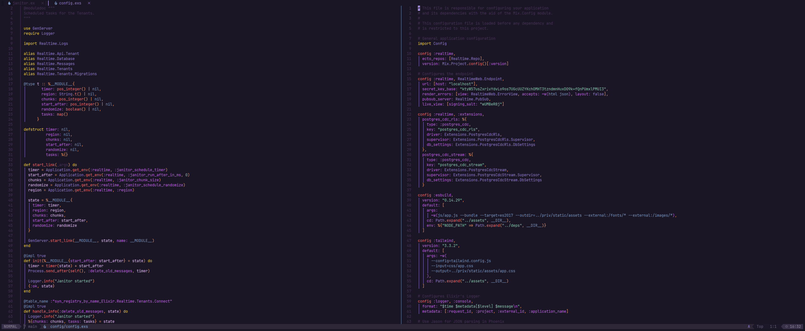
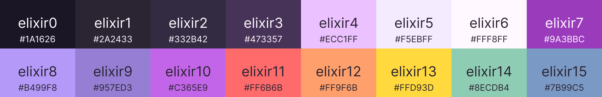

# 🧙‍♂️ Elixir-Bloom Theme

A Neovim colorscheme that draws inspiration from the mystical world of alchemy and the elegant nature of the Elixir programming language. Like a blooming flower in a magical garden, this theme combines deep purples and ethereal pinks to create a harmonious and enchanting development environment.



## 🎨 Color Palette


The theme embodies the alchemical principles and Elixir's core values:

- **Darkest Background (#1A1626)**: The depth of the midnight sky, where alchemical transformations begin
- **Elixir Purple (#9A3BBC)**: The signature color of Elixir, representing transformation and power
- **Bright Purple (#C365E9)**: Like a vibrant bloom, symbolizing growth and creativity
- **Purple-tinted White (#F5EBFF)**: The ethereal glow of successful transmutation
- **Bluish Purple (#957ED3)**: The mystical essence of alchemical processes

Key features of the color scheme:
- High contrast for excellent readability
- Carefully selected purple variants for syntax highlighting
- Warm accent colors for important elements
- Soothing background gradients for long coding sessions
- Strategic color placement to reduce eye strain

## ⚡ Quick Installation

Using [lazy.nvim](https://github.com/folke/lazy.nvim):
```lua
return {
  "abreujp/elixir-bloom.nvim",
  lazy = false,
  priority = 1000,
  config = function()
    vim.cmd([[colorscheme elixir-bloom]])
  end,
}
```

Using [packer.nvim](https://github.com/wbthomason/packer.nvim):
```lua
use {
  "abreujp/elixir-bloom.nvim",
  config = function()
    vim.cmd([[colorscheme elixir-bloom]])
  end
}
```

## 🎨 Features

- Syntax highlighting optimized for Elixir and functional programming
- Full LSP diagnostic support with intuitive color coding
- Enhanced Treesitter integration
- Comprehensive plugin support
- Terminal colors for a seamless experience
- Dark variant (light theme coming soon)

## 🛠️ Configuration

```lua
require("elixir-bloom").setup({
  -- Override default colors
  colors = {
    background = "#1A1626",
    foreground = "#F5EBFF",
  },
  -- Enable/disable specific features
  features = {
    italic_comments = true,
    transparent_background = false,
    dim_inactive_windows = true,
  },
  -- Plugin-specific settings
  plugins = {
    telescope = true,
    nvim_tree = true,
    lualine = true,
  }
})
```

## 📦 Integrated Plugins

- [telescope.nvim](https://github.com/nvim-telescope/telescope.nvim)
- [nvim-tree.lua](https://github.com/nvim-tree/nvim-tree.lua)
- [lualine.nvim](https://github.com/nvim-lualine/lualine.nvim)
- [bufferline.nvim](https://github.com/akinsho/bufferline.nvim)
- [gitsigns.nvim](https://github.com/lewis6991/gitsigns.nvim)
- [which-key.nvim](https://github.com/folke/which-key.nvim)
- [indent-blankline.nvim](https://github.com/lukas-reineke/indent-blankline.nvim)


## 🤝 Contributing

Contributions are welcome! See our [Contributing Guide](CONTRIBUTING.md) for details.

## 📝 License

This project is licensed under the MIT License - see the [LICENSE](./LICENSE) file for details.

## 🙏 Acknowledgments

- The Elixir community for their magical programming language
- Alchemical traditions that inspired the color choices
- [Neovim](https://neovim.io/) team
- All contributors and users

---
Crafted with 💜 by [abreujp](https://github.com/abreujp)